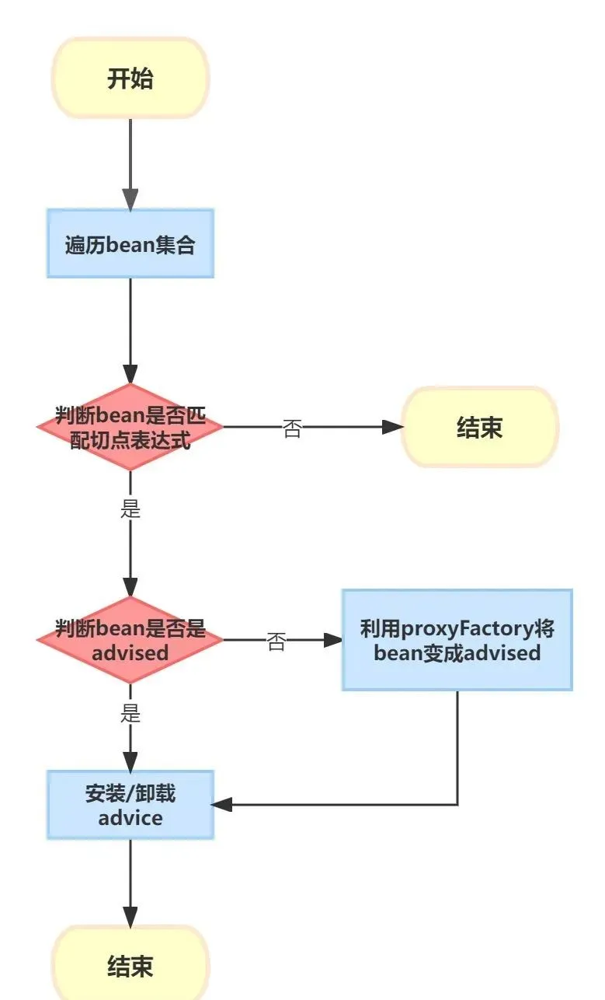

# SpringBoot 实现动态插拔的 AOP

现在有这么一个需求：就是我们日志的开与关是交给使用人员来控制的，而不是由我们开发人员固定写死的。大家都知道可以用aop来实现日志管理，但是如何动态的来实现日志管理呢？

aop源码中的实现逻辑中有这么一个步骤，就是会依次扫描Advice的实现类，然后执行。我们要做的就是自定义一个advice的实现类然后，在用户想要开启日志的时候就把advice加到项目中来，关闭日志的时候就把advice剔除就行了。

## 前置知识

### Advice:

`org.aopalliance.aop.Advice`

“通知”，表示 Aspect 在特定的 Join point 采取的操作。包括 “around”, “before” and “after 等
Advice，大体上分为了三类：BeforeAdvice、MethodInterceptor、AfterAdvice

### Advisor:

```
org.springframework.aop.Advisor
```

“通知者”，它持有 Advice，是 Spring AOP 的一个基础接口。它的子接口 PointcutAdvisor 是一个功能完善接口，它涵盖了绝大部分的
Advisor。

### Advised:

```
org.springframework.aop.framework.Advised
```

AOP 代理工厂配置类接口。提供了操作和管理 Advice 和 Advisor 的能力。它的实现类 ProxyFactory 是 Spring AOP 主要用于创建 AOP
代理类的核心类。

## 热插拔AOP执行核心逻辑



### 核心实现代码

1. 动态管理advice端点实现
    ```java
    @Slf4g
    @RestControllerEndpoint(id = "proxy")
    @RequiredArgsConstructor
    public class ProxyMetaDefinitionControllerEndPoint {
        private final ProxyMetaDefinitionRepository proxyMetaDefinitionRepository;
    
        @GetMapping("listMeta")
        public List<ProxyMetaDefinition> getProxyMetaDefinitions() {
            return proxyMetaDefinitionRepository.getProxyMetaDefinitions();
        }
    
        @GetMapping("{id}")
        public ProxyMetaDefinition getProxyMetaDefinition(@PathVariable("id") String proxyMetaDefinitionId) {
            return proxyMetaDefinitionRepository.getProxyMetaDefinition(proxyMetaDefinitionId);
        }
    
        @PostMapping("save")
        public String save(@RequestBody ProxyMetaDefinition definition) {
    
            try {
                proxyMetaDefinitionRepository.save(definition);
                return "success";
            } catch (Exception e) {
                log.info("error");
            }
            return "fail";
        }
    
        @PostMapping("delete/{id}")
        public String delete(@PathVariable("id") String proxyMetaDefinitionId) {
            try {
                proxyMetaDefinitionRepository.delete(proxyMetaDefinitionId);
                return "success";
            } catch (Exception e) {
                log.info("error");
            }
            return "fail";
        }
    
    }
    ```

2. 利用事件监听机制捕获安装或者卸载插件

    ```java
    @RequiredArgsConstructor
    public class ProxyMetaDefinitionChangeListener {
    
        private final AopPluginFactory aopPluginFactory;
    
        @EventListener
        public void listener(ProxyMetaDefinitionChangeEvent proxyMetaDefinitionChangeEvent){
            ProxyMetaInfo proxyMetaInfo = aopPluginFactory.getProxyMetaInfo(proxyMetaDefinitionChangeEvent.getProxyMetaDefinition());
            switch (proxyMetaDefinitionChangeEvent.getOperateEventEnum()){
                case ADD:
                    aopPluginFactory.installPlugin(proxyMetaInfo);
                    break;
                case DEL:
                    aopPluginFactory.uninstallPlugin(proxyMetaInfo.getId());
                    break;
            }
        }
    }
    ```
3. 安装插件

   ```java
   public void installPlugin(ProxyMetaInfo proxyMetaInfo) {
       if (StringUtils.isEmpty(proxyMetaInfo.getId())) {
           proxyMetaInfo.setId(proxyMetaInfo.getProxyUrl() + SPIILT + proxyMetaInfo.getProxyClassName());
       }
       AopUtil.registerProxy(defaultListableBeanFactory, proxyMetaInfo);
   }
   ```

4. 安装插件核心实现
   ```java
   public static void registerProxy(DefaultListableBeanFactory beanFactory, ProxyMetaInfo proxyMetaInfo) {
      AspectJExpressionPointcutAdvisor advisor = getAspectJExpressionPointcutAdvisor(beanFactory, proxyMetaInfo);
      addOrDelAdvice(beanFactory, OperateEventEnum.ADD, advisor);
   }
   
   private static AspectJExpressionPointcutAdvisor getAspectJExpressionPointcutAdvisor(DefaultListableBeanFactory beanFactory, ProxyMetaInfo proxyMetaInfo) {
      BeanDefinitionBuilder builder = BeanDefinitionBuilder.genericBeanDefinition();
      GenericBeanDefinition beanDefinition = (GenericBeanDefinition) builder.getBeanDefinition();
      beanDefinition.setBeanClass(AspectJExpressionPointcutAdvisor.class);
      AspectJExpressionPointcutAdvisor advisor = new AspectJExpressionPointcutAdvisor();
      advisor.setExpression(proxyMetaInfo.getPointcut());
      advisor.setAdvice(Objects.requireNonNull(getMethodInterceptor(proxyMetaInfo.getProxyUrl(), proxyMetaInfo.getProxyClassName())));
      beanDefinition.setInstanceSupplier((Supplier<AspectJExpressionPointcutAdvisor>) () -> advisor);
      beanFactory.registerBeanDefinition(PROXY_PLUGIN_PREFIX + proxyMetaInfo.getId(), beanDefinition);
      return advisor;
   }
   ```

5. 卸载插件
   ```java
   public void uninstallPlugin(String id) {
      String beanName = PROXY_PLUGIN_PREFIX + id;
      if (defaultListableBeanFactory.containsBean(beanName)) {
         AopUtil.destoryProxy(defaultListableBeanFactory, id);
      } else {
         throw new NoSuchElementException("Plugin not found: " + id);
      }
   }
   ```

6. 卸载插件核心实现

   ```java
   public static void destroyProxy(DefaultListableBeanFactory beanFactory, String id) {
      String beanName = PROXY_PLUGIN_PREFIX + id;
      if (beanFactory.containsBean(beanName)) {
         AspectJExpressionPointcutAdvisor advisor = beanFactory.getBean(beanName, AspectJExpressionPointcutAdvisor.class);
         addOrDelAdvice(beanFactory, OperateEventEnum.DEL, advisor);
         beanFactory.destroyBean(beanFactory.getBean(beanName));
      }
   }
   ```

7. 操作advice实现

   ```java
   public static void addOrDelAdvice(DefaultListableBeanFactory beanFactory, OperateEventEnum
           operateEventEnum, AspectJExpressionPointcutAdvisor advisor) {
      AspectJExpressionPointcut pointcut = (AspectJExpressionPointcut) advisor.getPointcut();
      for (String beanDefinitionName : beanFactory.getBeanDefinitionNames()) {
         Object bean = beanFactory.getBean(beanDefinitionName);
         if (!(bean instanceof Advised advisedBean)) {
            if (operateEventEnum == OperateEventEnum.ADD) {
               buildCandidateAdvised(beanFactory, advisor, bean, beanDefinitionName);
            }
            continue;
         }
          boolean isFindMatchAdvised = findMatchAdvised(advisedBean.getClass(), pointcut);
         if (operateEventEnum == OperateEventEnum.DEL) {
            if (isFindMatchAdvised) {
               advisedBean.removeAdvice(advisor.getAdvice());
               log.info("########################################## Remove Advice -->【{}】 For Bean -->【{}】 SUCCESS !"
                       , advisor.getAdvice().getClass().getName(), bean.getClass().getName());
            }
         } else if (operateEventEnum == OperateEventEnum.ADD) {
            if (isFindMatchAdvised) {
               advisedBean.addAdvice(advisor.getAdvice());
               log.info("########################################## Add Advice -->【{}】 For Bean -->【{}】 SUCCESS !", advisor.getAdvice()
                       .getClass().getName(), bean.getClass().getName());
            }
         }
   
      }
   }
   ```

### 热插拔AOP演示示例

1. 创建一个service
   ```java
   @Service
   @Slf4j
   public class HelloService implements BeanNameAware, BeanFactoryAware {
   private BeanFactory beanFactory;
   
       private String beanName;
   
       @SneakyThrows
       public String sayHello(String message) {
           Object bean = beanFactory.getBean(beanName);
           log.info("============================ {} is Advised : {}",bean, bean instanceof Advised);
           TimeUnit.SECONDS.sleep(new Random().nextInt(3));
           log.info("============================ hello:{}",message);
   
           return "hello:" + message;
   
       }
   
       @Override
       public void setBeanFactory(BeanFactory beanFactory) {
           this.beanFactory = beanFactory;
       }
   
       @Override
       public void setBeanName(String name) {
           this.beanName = name;
       }
   
   }
   ```

2. 创建一个controller

   ```java
   @RestController
   @RequestMapping("hello")
   @RequiredArgsConstructor
   public class HelloController {
   
      private final HelloService helloService;
   
      @GetMapping("{message}")
      public String sayHello(@PathVariable("message") String message) {
         return helloService.sayHello(message);
      }
   
   }
   ```

3. 准备一个日志切面jar

   ```java
   @Slf4j
   public class LogMethodInterceptor implements MethodInterceptor {
      @Override
      public Object invoke(MethodInvocation invocation) throws Throwable {
         Object result;
         try {
            result = invocation.proceed();
         } finally {
            log.info(">>>>>>>>>>>>>>>>>>>>>>>>TargetClass:【{}】,method:【{}】,args:【{}】",invocation.getThis().getClass().getName()
                    ,invocation.getMethod().getName(), Arrays.toString(invocation.getArguments()));
         }
   
         return result;
      }
   
   }
   ```

## 总结

本文实现热插拔AOP就在于对advice、advised、advisor、pointcut概念的理解，
这是实现热插拔AOP的前提，其次就是对自定义classloader也需要有一定的了解，
因为我们jar不一定从classpath底下加载，也有可能来源其他地方，
比如远程链接啥的，最后就是把原先spring自动帮我们实现aop，
我们利用相关的api，自己手动实现一遍，
示例代码的api只是利用spring api其中一种实现方式，它还有多种实现方式，
比如可以利用TargetSource，感兴趣的朋友，也可以自己实现一把。

至于那个代理增删改查端点controller，是我之前看springCloud gateway的路由
定位器端点源码，一直没找到机会实现一下，就把他搬来这个示例实现一把，
加深一下印象。